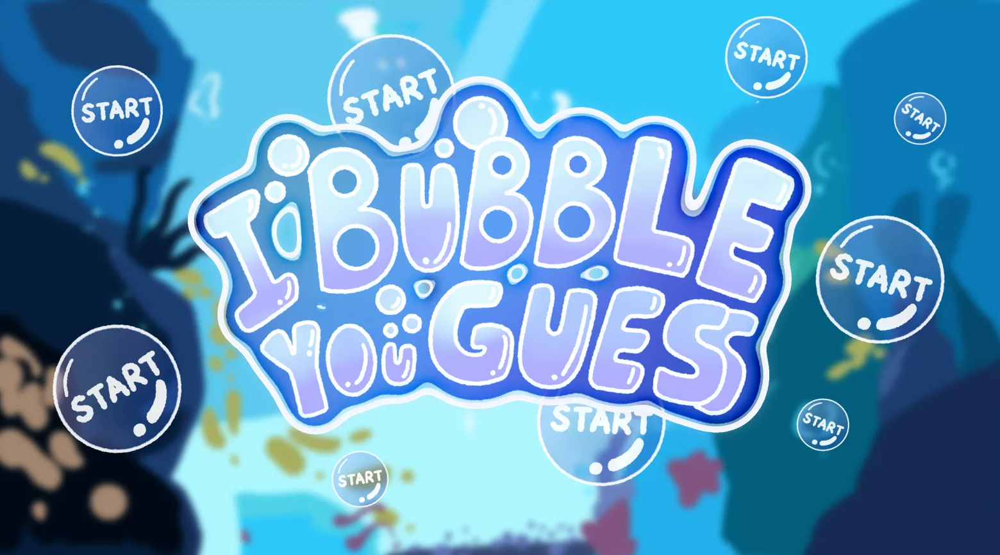
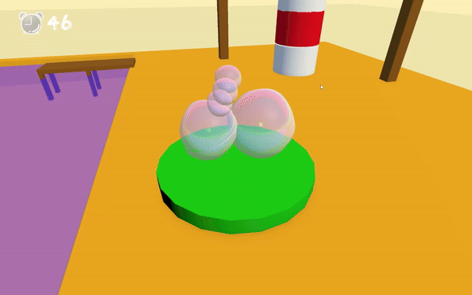

# I Bubble You Guess

**I Bubble You Guess** is a Bubble themed interactive 3D pictionary game made during [Global Game Jam Hong Kong 2025](https://ggjhk.com/). We are honored to receive the **Most Unique Concept** Award presented by Kowloon & Kepler!

This repo is to store our source code. Feel free to refer to our code and use our [original font](https://github.com/jiaqi404/I_Bubble_You_Guess/blob/main/Assets/TextMesh%20Pro/Fonts/Bubble_guess-Regular%20SDF.asset)!

## YouTube Overview

## Links
For more details, check our [GGJ page](https://globalgamejam.org/games/2025/i-bubble-you-guess-1).

To play it online, check our [itch.io page](https://captainceleste.itch.io/i-bubble-you-guess).
